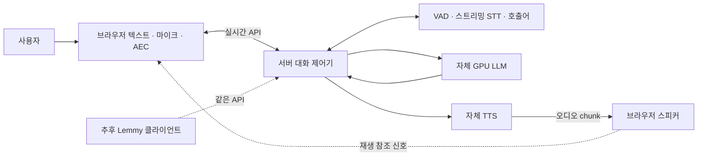

# real-PA 통합 아키텍처

## 목적과 현재 상태

- 목적: 독립 테스트 브라우저의 한국어 양방향 대화, 추후 Lemmy가 클라우드 API 사용
- 현재 구현: 역할별 포트·설정·registry·자체 모델/RPC·대화 제어·HTTP 브라우저·versioned API
- 실제 모델 RPC smoke와 fixture 제어 시험은 통과, 신규 브라우저의 실제 모델·실기기·배포 인수는 진행 중
- 현재 구현 목록은 아래 구현 경로 절 기준. 나머지 흐름·품질 조건은 목표 설계
- [요구사항](../requirements/README.md)의 품질 목표는 측정 전 수치

## 제약 사항

- 핵심 대화·메모·알림 실행에 외부 AI API 불사용
- 기존 공개 모델의 로컬 추론 허용, 모델 자체의 처음부터 학습 제외
- Lemmy 인증·생체 정책·사용자 DB·로봇 safety 경계 보존
- 모델·오디오 장치·GPU 동시 용량 확인 전 지원 하드웨어 확정 금지
- Python 비동기 제어 후보, 실제 프레임워크·의존성·버전은 T002 이후 확정

## 맥락과 범위



- 양방향의 첫 목표: 지속 입력과 동시 출력, 끼어들기·후속 문맥 처리
- 동시 발화의 의미·감정·백채널을 통합 학습한 음성 모델과 동등한 품질은 보장 범위 아님
- real-PA 서버: 세션·추론·취소·streaming 출력 조율, browser client: capture·AEC·playback
- Lemmy: 추후 API 클라이언트, 업무 사용자 인증·권한·데이터·행동 상태 소유

## 구성 요소

| 구성 요소 | 책임 | 포트·데이터 |
| --- | --- | --- |
| Audio I/O | 지속 capture, 실제 playback, 제한된 큐, 장치 변경 | PCM 프레임·샘플 시각·재생 확인 |
| AEC | 재생 참조 신호 기반 반향 억제 | capture/render 동기화·지연 보정 |
| KWS/VAD | 세션 시작·발화 감지·종료 후보 | 감지 시각·confidence |
| Streaming STT | 발화 중 부분 결과와 최종 전사 | 부분 결과 교체 가능, 최종 확정 구분 |
| Dialogue Controller | 턴·취소·상태·도구 조율 | session_id·turn_id·generation_id |
| Local LLM | 문맥 기반 토큰·도구 후보 생성 | 교체 가능한 스트리밍 포트 |
| Local TTS | 짧은 구절의 오디오 생성 | chunk ID·샘플 수·취소 토큰 |
| Lemmy Adapter | 도구 allowlist·정책·화면 이벤트 연결 | 인증된 문맥·tool_call_id·operation_id |
| Observability | 지연·실패·자원 측정 | 개인 내용 없는 메트릭 |

### 기존 프로젝트 재사용 경계

| 자산 | 활용 후보 | 확인·변경 필요 |
| --- | --- | --- |
| stt_test | Sherpa KWS·Silero VAD·SenseVoice 경험 | 부분 결과 STT 추가, SenseVoice의 구간 인식과 구분 |
| lemmy-wekws | 호출어 학습·평가 자산 | 현재 artifact·revision·장치 정확도 확인 |
| LocalForge | llama.cpp·GPU 실행·스트리밍 기준선 | Coder fixture 검증은 한국어 비서·도구 품질 증거 아님 |
| chatting | 세션·포트·로컬 LLM/TTS 어댑터 | 지속 세션·동시 실행·취소 확대 |
| tts-serving | GPT-SoVITS 로컬 음성 합성 | 첫 chunk 지연·구절 안정성·모델 버전 실측 |
| streaming_pipeline | 지속 작업·소유권·복구 경험 | 오디오 경로에 Kafka 왕복 도입 금지 |
| morphflow | retry·관측·긴 작업 상태 경험 | 음성·등록 요청의 무조건 재시도 금지 |
| laya-routing-poc | 로컬 의도 후보 분류 실험 | 필수 경로 아님, 정확도·직접 실행 효과 별도 평가 |
| Lemmy | 도구 정의·사용자 기억·기능 화면 | 실제 revision 및 서비스 호출 경계 확인 |

외부 저장소는 참고 자산. 이 저장소에 제품 코드 전체 복사나 의존성 자동 설치 없음.

## 실행 흐름

### 정상 대화

1. 호출어/UI로 세션 시작, 입력 ring buffer의 pre-roll을 포함해 발화 수집
2. 입력·AEC·VAD·STT 지속 수행, 부분 전사는 UI용으로 갱신
3. 종료 판단으로 최종 발화 확정, 새 turn_id와 generation_id 발급
4. LLM 토큰 스트리밍 및 구절 경계 확정, TTS·재생을 별도 작업으로 실행
   공백·줄바꿈만 있는 구절은 합성 제외, 텍스트 stream의 원문은 유지
5. 현재 프로필은 독립 대화, 도구 어댑터·권한·업무 처리는 후속 통합 프로필
6. 실제 출력 샘플 기준 답변 재생 범위 기록, 후속 발화 대기

부분 STT를 사용하는 선행 추론은 후속 최적화. 부분 전사만으로 등록·삭제 등 쓰기 실행 금지.

### 끼어들기

1. AEC 처리 후 사용자 발화 시작 확인
2. generation_id 증가 및 기존 생성 취소 신호 전달
3. 재생 즉시 중단, 이전 audio 큐 폐기, LLM·TTS 작업 취소·종료 확인
4. 늦게 도착한 이전 generation 결과를 출력 경로에서 폐기
5. 실제 재생 범위만 대화 기록에 반영, 새 발화 처리
6. 실행 중 도구의 완료·실패·불확실 상태는 원래 operation_id로 별도 보존

### 세션 상태

- 세션: `idle → active → closing → closed`, 복구 필요 시 `error`
- 활동: `capturing`, `recognizing`, `generating`, `playing`, `executing_tool`의 동시 상태 집합
- 단일 `speaking/listening` 배타 상태로 모델링 금지, 출력 중 capture 유지
- UI 대표 상태는 활동 집합의 투영, 마이크 실행 여부와 구분

### 오류와 복구

- 큐 용량·시간 상한 설정, 넘친 출력은 조용히 이어 붙이지 않고 해당 generation 중단
- 입력 손실은 계측·표시 후 발화 재입력 요청, 잘린 오디오로 쓰기 실행 금지
- 모델 timeout·GPU 부족: 해당 턴 실패 안내, 자원 회수, 반복 실패 시 세션 종료
- 오디오 장치 손실: 재생 중단·입력 중지·재연결 안내
- 도구 timeout: 이미 실행했는지 불확실한 상태 표시, 조회·키 기반 복구 후 판단
- 기존 Lemmy 경로로 전환 시 신규 세션 사용, 취소된 쓰기 자동 재전송 금지

## 내부 계약 초안

- 오디오: mono PCM16 후보, 입력 16kHz 후보; 출력 sample rate는 TTS native 값 명시
- 프레임 메타데이터: stream·sequence·sample_rate·sample_count·monotonic timestamp
- 세션 이벤트: session_id·turn_id·generation_id·type·sequence·timestamp
- 주요 이벤트: speech_started, transcript_partial, transcript_final, audio_chunk, playback_ack, interrupted, tool_result, session_closed, error
- 부분 전사 교체·중복 이벤트·역순 이벤트의 처리 정책 명시 필수
- 실제 공개 프로토콜 확정 전 브라우저 WebSocket·PCM 캡처와 Python 장치 입력 비교 예정

### 도구 실행 불변 조건

- 신뢰 문맥의 user_id만 사용, 모델이 생성한 user_id는 무시·거부
- operation_id·정규화한 인자·사용자 범위의 내구성 있는 중복 방지 기록
- 실행 상태: pending·running·succeeded·failed·unknown, 음성 generation과 별도 수명
- 재시도는 결과 조회 또는 멱등 계약이 있는 경우만 허용
- 사용자 요청 수정과 이전 작업 취소/보상은 별도 처리, 실행된 결과를 없었다고 기록 금지

## 배포 목표

- 첫 검증: 단일 사용자·단일 PC·헤드셋, 이어서 PC의 스피커·마이크
- 현재: 단일 API 서버의 테스트 브라우저에서 텍스트와 음성으로 연속 대화
- 후속: 클라우드에 대화 파이프라인 배포, Lemmy는 capture/playback·업무 권한과 API 접속 담당
- 외부 AI API 불사용과 모든 모델의 로봇 단독 실행은 서로 다른 조건
- 모델은 프로세스 간 포트 또는 로컬/LAN 인터페이스로 분리 가능
- 장치와 호스트 이동의 음성 품질·네트워크 지연은 별도 측정
- 첫 구현의 Kafka·Kubernetes·LiveKit 필수 의존성 없음

## 데이터

- Lemmy: 사용자·메모·알림·권한·영구 대화 문맥의 기준 소유자
- real-PA: 활성 세션의 임시 오디오·부분 전사·재생 진행·generation 상태
- 생성 텍스트와 실제 들려준 텍스트 구분; 중단 구절은 오디오 정렬이 없으면 보수적 범위 기록
- 원시 음성 기본 미저장, 평가용 저장은 명시적 선택과 보존·삭제 조건 필요
- 임시 세션 기록의 TTL·도구 중복 방지 기간은 T003·T005에서 확정

## 공통 관심사

- 현재 API 인증: 접속 키와 Origin·세션 상한, 회사 접속은 TLS proxy 경계
- 후속 Lemmy 권한: 업무 문맥 검증, 진단 출력의 개인정보 제외
- 관측: monotonic 시간, 음성 종료 정답 시각과 endpoint 확정 시각 별도 기록
- 성능: warm/cold·모델별·동시 실행 GPU 메모리·큐 깊이·실제 playback 지연 측정
- 변경: 모델 revision·artifact SHA256·런타임 버전 고정, adapter contract 검증
- 라이선스: 모델·데이터·음성 샘플별 사용과 재배포 조건 기록

## 알려진 위험과 기술 부채

| 항목 | 영향 | 대응 | 담당 |
| --- | --- | --- | --- |
| 반향 제거·장치 동기화 미검증 | 자체 음성 인식·거짓 중단 | T003·T006 실기기 평가 | 프로젝트 소유자 |
| GPU 동시 용량 미확정 | 지연·메모리 부족 | T002 단독/동시 실측 | 프로젝트 소유자 |
| 한국어 모델 품질 미검증 | 잘못된 답변·도구 인자 | T002 평가셋과 기준 확정 | 프로젝트 소유자 |
| TTS의 첫 chunk·취소 미검증 | 응답 지연·이전 음성 잔류 | T004 측정·generation 필터 | 프로젝트 소유자 |
| Lemmy 문서·코드 차이 가능 | 경계 우회·기능 실패 | T005 revision 고정과 실제 계약 점검 | 프로젝트 소유자 |
| 모델 선택 미확정 | 재현·배포 조건 불확실 | artifact·license manifest 작성 | 프로젝트 소유자 |

## 관련 문서

- [요구사항](../requirements/README.md), [ADR](../decisions/README.md)
- [작업 목록](../tasks/README.md), [검증 계획](../guides/testing.md)

## 참고 자산 확인 기록

2026-10-01 작업 폴더의 README·Lemmy 음성 문서·SoundOrchestrator 기준 점검.
아래 HEAD는 추적 기준이며 작업 폴더의 변경·실행 성공을 보증하지 않음.

| 프로젝트 | HEAD | 확인 근거 |
| --- | --- | --- |
| Lemmy | 1cab6e9 | 음성·LiveKit 문서, SoundOrchestrator, provider-neutral 도구 정의 |
| stt_test | c942ccc | KWS·VAD·SenseVoice README |
| LocalForge | 9d03e0a | GPU·모델·fixture 검증 범위 README |
| chatting | a8280e0 | LLM/TTS·세션·포트 README |
| tts-serving | c0807c6 | GPT-SoVITS 서빙 README |
| streaming_pipeline | dfc8ad5 | 지속 스트림·lease·복구 README |
| morphflow | 3061107 | 추론 단계·retry·관측 README |
| laya-routing-poc | b0aa80e | 로컬 후보 분류·모의 실행의 한계 README |
| lemmy-wekws | Git 저장소 아님 | 폴더·문서 목록만 확인, artifact 상세 평가는 T002 |

본 문서 패키지의 실행·검증에 외부 저장소의 존재는 필수 아님.
모델의 최신 기능·성능 수치·지원 여부는 이 기록에서 주장하지 않음.

## 모델 교체 계약

- **상태:** 공통 포트·설정 parser·registry·제어 계약 구현. 역할별 실제 모델 2개 교체 시험 미완료
- **근거:** [REQ-MODEL-001](../requirements/REQ-MODEL-001.md), [ADR-0004](../decisions/ADR-0004-model-ports.md)
- **의존 방향:** 대화 코어 → 포트 ← 모델별 어댑터, composition root가 설정으로 주입
- SDK import·provider 전용 event·모델 경로 분기는 어댑터와 composition root에만 허용
- 동일 엔진의 호환 모델은 설정·manifest 변경, 다른 엔진은 어댑터 구현·registry 등록 추가

### 역할별 포트

아래는 구현할 의미 계약. 정확한 Python signature는 T003에서 확정.

| 포트 | 입력 | 표준 출력 | 필수 의미 |
| --- | --- | --- | --- |
| LlmPort | 표준 메시지·도구 schema·generation 문맥 | TextDelta·ToolCall·Completed | 토큰/도구 ID 정규화, 명시적 완료, cancel |
| StreamingSttPort | 순서 있는 AudioFrame·발화 종료 | TranscriptPartial·TranscriptFinal | partial 교체 ID, final 확정, reset |
| TtsPort | 확정 구절·언어·voice·generation | AudioChunk·Completed | sample rate·sequence·구절 ID, cancel |
| KwsPort | 연속 AudioFrame·keyword 설정 | WakeDetected | keyword ID·감지 시각·score, reset |
| VadPort | 연속 AudioFrame | SpeechStarted·SpeechEnded | 구간 ID·시각·score, reset |
| AecPort | capture·render 참조 AudioFrame | 정제된 AudioFrame | 시간 정렬·형식 변환·장치 reset |

- 공통 AudioFrame: PCM 자료·sample_rate·channels·sample_count·sequence·monotonic 시각
- 공통 Context: session_id·turn_id·generation_id·deadline·cancellation token
- 표준 도구 인자는 검증 가능한 JSON 자료형, 원시 SDK 객체 전달 금지
- 부분 전사를 final처럼 취급하거나 구간 STT를 streaming STT로 선언 금지
- 음성 언어·voice 설정·score의 의미 차이는 어댑터 metadata로 노출

### 공통 lifecycle과 오류

- `load(config)` → `capabilities/health` 확인 → stream/process → reset → close
- 취소: 로컬 작업·remote-local 요청·출력 큐 각각 종료, 늦은 출력 generation 필터 필수
- reset: 활성 작업 종료 후 세션별 상태 제거, 다른 세션 state 공유 금지
- close: idempotent, task·GPU 자원·socket·오디오 버퍼 해제
- 오류: ConfigurationError·UnsupportedCapability·ModelLoadError·ResourceExhausted·Timeout·ProviderUnavailable·InvalidOutput
- Cancelled는 정상 취소 결과로 분리, 원시 SDK 오류는 adapter에서 변환
- GPU 호출이 즉시 중단되지 않는 경우 capability에 취소 한계 표시, timeout과 출력 폐기는 유지

### 설정·manifest와 composition root

설정 예시는 의미 설명용이며 현재 실행 가능한 파일 아님.

```yaml
providers:
  llm:
    adapter: local_llm_engine_a
    model_manifest: manifests/llm-a.json
    device: cuda:0
    options: {}
  stt:
    adapter: streaming_stt_engine_a
    model_manifest: manifests/stt-a.json
    device: cpu
  tts:
    adapter: local_tts_engine_a
    model_manifest: manifests/tts-a.json
    device: cuda:0
  kws:
    adapter: kws_engine_a
    model_manifest: manifests/kws-a.json
    device: cpu
  vad:
    adapter: vad_engine_a
    model_manifest: manifests/vad-a.json
    device: cpu
```

- 공통 필드: adapter·model_manifest·device·timeout, 엔진별 options는 해당 adapter가 schema 검증
- manifest: model_id·revision·artifact SHA256·runtime version·license·언어·오디오 형식·capabilities·자원 요구
- registry: 허용된 adapter ID → factory 매핑, 설정의 임의 import path 실행 금지
- composition root: 설정·manifest 검증 → factory 선택 → load → capability 확인 → 포트 주입
- 실패: 이미 load한 자원 정리, 부분 조합으로 세션 시작 금지, 외부 API 자동 전환 금지
- 세션 기록: 적용된 모델 조합 식별자 저장, 변경 후 이전 결과와 비교 가능

### 기능 협상과 교체 절차

| 역할 | 기본 대화에 필요한 기능 | 미지원 시 처리 |
| --- | --- | --- |
| LLM | 한국어·토큰 streaming·Lemmy 도구 호출 | 해당 제품 프로필 시작 거부 |
| STT | 한국어·partial/final·연속 입력 | streaming 프로필 거부, 구간 모드는 별도 명시 |
| TTS | 한국어·구절 입력·chunk 형식·취소/출력 폐기 | 비서 음성 프로필 거부 |
| KWS | 설정한 한국어 호출어·연속 입력 | 호출어 모드 거부, 명시적 UI 시작은 허용 |
| VAD | 연속 입력·시작/종료 시각 | 음성 세션 시작 거부 |

1. 같은 역할의 새 adapter/model 조합과 capability·manifest 확인
2. 해당 역할의 공통 계약 시험·한국어 품질·단독/동시 자원 평가
3. 설정으로 새 조합 선택, 새 세션에서만 적용
4. 끼어들기·기억·Lemmy 도구 회귀와 지연 비교
5. 실패 시 이전 설정·manifest 복원, 실행된 업무 상태는 보존

LLM tool calling 없는 모델은 일반 대화 전용으로 별도 프로필 허용 가능.
기능 부족을 조용히 숨기거나 본 제품의 Lemmy 도구 지원 완료로 보고 금지.
실시간 TTS는 전체 발화 완료 전 구절별 합성으로도 구성 가능하나 실제 첫 chunk 지연 별도 측정.

## 회사 GPU와 로봇의 실행 경계

- 현재 우선순위는 독립 브라우저·클라우드 대화 API, 최종 로봇 배치는 [ADR-0007](../decisions/ADR-0007-confirmed-robot-control.md)의 사용자 답변 반영
- 개발 GPU: RTX 3090 24GB, CUDA 모델 서버 실행 확인
- 대상 OS: Ubuntu 26, 현재 개발 Python 3.12 환경의 검증과 구분
- 회사 worker: LLM·STT·TTS·KWS·VAD 추론, 사용자 DB·권한·업무 실행 소유하지 않음
- 독립 브라우저 검증의 API 서버: 세션 문맥·지속 입력 처리·모델 파이프라인·끼어들기·generation 출력 격리
- 최종 Lemmy 로봇: 입출력·대화 제어, 회사 GPU worker: 모델 추론. 기존 robot/RPC 경로의 동시 입력 안정성 인수 필요
- 브라우저: 지속 capture·AEC·playback·재생 ack, 개인 업무는 후속 Lemmy 경계
- RPC: 인증된 역할별 요청·streaming event, 연결 종료/취소 시 worker task 취소
- 공개 네트워크: `wss` 사용, 현재 worker는 loopback 바인딩과 TLS reverse proxy 배치 전제
- 별도 회사 서버 구축·인증서·실제 WAN 지연은 아직 검증되지 않음

### 현재 구현 경로

| 경로 | 구현 내용 | 한계 |
| --- | --- | --- |
| `src/real_pa/contracts.py` | 5개 역할 포트, 표준 요청·event·context·오류 | signature 세분화·완전한 형식 검증 후속 |
| `src/real_pa/config.py`, `registry.py` | 설정·hash·capability·명시적 factory·로드 실패 정리 | 전체 실제 모델 조합 인수 전 |
| `src/real_pa/adapters/chat_http.py` | 자체 llama.cpp/vLLM 형식 SSE·도구 fragment 정규화 | 현재 Qwen의 도구 품질 미검증 |
| `src/real_pa/adapters/sherpa.py` | streaming STT·KWS·Silero VAD·Supertonic TTS | CPU native 취소는 실행 종료를 기다리고 출력 폐기 |
| `src/real_pa/adapters/sensevoice.py` | 명시적 buffered partial·SenseVoice offline STT | 실제 모델/20회 합성 브라우저 통과·한국어 품질/실기기 인수 전 |
| `src/real_pa/adapters/rpc.py` | 회사 inference worker·remote adapter·실제 capability 협상 | WAN 성능·세션 상태 만료 보강 필요 |
| `src/real_pa/session.py` | 병렬 LLM/TTS·generation 취소·오디오 ack·bounded output | 부분 재생 구절은 보수적으로 기억 제외 |
| `src/real_pa/robot.py`, `robot_gateway.py` | 지속 VAD·발화 구간 STT·기본 직전 900ms 보존·출력 분리·끼어들기 | standalone은 개발 token, Lemmy route는 쿠키·binding 확인 |
| `src/real_pa/adapters/lemmy_llm.py` | 기존 LlmPort schema와 자체 서버 변환 | 실제 Lemmy application E2E 미검증 |
| `src/real_pa/api.py` | HTTP 브라우저·health·인증된 `/v1/realtime`·Origin·동시 상한 | 회사 TLS·WAN·운영 인수 전 |
| `src/real_pa/browser/` | 텍스트·마이크 전환·지속 입력·AEC·generation 재생 중단 | 합성 브라우저 검증·실제 물리 반향 성능 미검증 |
| `src/real_pa/tool_loop.py` | 선택적 모델 중립 도구 반복·쓰기 취소 분리 | 현재 standalone 프로필에서 미사용 |

- registry는 전체 역할·adapter 등록·선언 capability를 모델 load 전에 검사, 후반 설정 오류 때문에 앞선 모델을 먼저 로드하는 경로 제외
- load 뒤에는 실제 provider 역할·capability 재검사 유지, 정적 선언만으로 실행 지원을 보장하지 않음
- 긴 발화의 STT stream은 기본 20초 단위로 최종화·reset, 구간 전사는 VAD의 자연 발화 종료까지 합산
- 구간 경계에서 LLM 요청·답변 생성 금지, 자연 종료 후 합친 전사로 한 번 submit
- 합친 전사 상한 4000자, 초과 시 현재 발화 제외 안내 후 연결·capture 유지. VAD 종료 뒤 새 입력 허용
- input_reset·close에서 구간 전사 폐기, audio_window는 기존 bounded 최근 구간 유지. 긴 발화 전체 WAV 보존 기능 아님
- 구간 경계의 인식 손실·한국어 품질은 실제 장문 평가 필요, 합성 입력 lifecycle 통과와 구분

### Lemmy 변경 경로

- 후속 단계로 우선순위 변경, 기존 미배포 변경 보존·추가 수정 중단
- `app/core/config.py`: LLM_BACKEND·LLM_SELFHOSTED_CONFIG·VOICE_DUPLEX_ENABLED·VOICE_DUPLEX_CONFIG 추가
- `app/runtime/provider_factory.py`: selfhosted 설정 시 real-PA lazy bridge 주입
- `docs/features/voice-conversation.md`: 전환 방법과 남은 Gemini·duplex 범위 기록
- `app/api/ws_duplex.py`: 별도 `/ws/duplex`, 기존 kiosk 쿠키와 Origin 확인·연결 중 사용자/binding 재검증
- 연결마다 remote provider와 서버 생성 UUID 세션 소유, 모델 가중치 없이 회사 RPC 설정만 허용
- `app/static/js/services/voice-duplex.js`: 지속 입력·로컬 즉시 재생 중단·ack, 기존 robot store의 상태·자막 연결
- `/api/voice/config`의 duplex 설정으로 기존 UI 경로 선택, 기존 `/ws`는 telemetry/event 용도로 유지
- duplex 플래그에서 기존 greet 생성 생략, 신규 경로의 도구·DB 기억·알림·실제 브라우저 검증은 미완료
- [duplex 전송 계약](../specs/duplex-transport.md)
- 시각·사주·STT 등 기존 Gemini 기능은 이 변경으로 전환되지 않음
